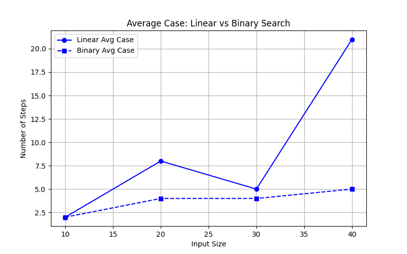
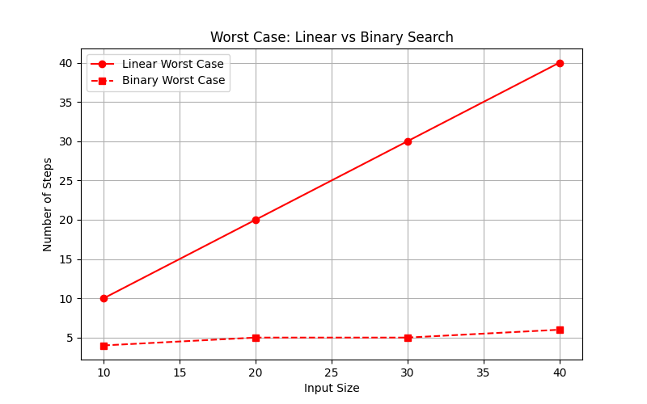

# Searching Algorithms

## Linear Search
## Binary Search


# Output:
```cpp

=================== Input Size: 10 ===================

Linear Search---------
Best Case= 1steps
Average Case= 2steps
Worst Case= 10steps
Binary Search----------
Best Case= 3steps
Average Case= 2steps
Worst Case= 4steps
===================================================================

=================== Input Size: 20 ===================

Linear Search---------
Best Case= 1steps
Average Case= 8steps
Worst Case= 20steps
Binary Search----------
Best Case= 4steps
Average Case= 4steps
Worst Case= 5steps
===================================================================

=================== Input Size: 30 ===================

Linear Search---------
Best Case= 1steps
Average Case= 5steps
Worst Case= 30steps
Binary Search----------
Best Case= 5steps
Average Case= 4steps
Worst Case= 5steps
===================================================================

=================== Input Size: 40 ===================

Linear Search---------
Best Case= 1steps
Average Case= 21steps
Worst Case= 40steps
Binary Search----------
Best Case= 5steps
Average Case= 5steps
Worst Case= 6steps
===================================================================
```
# Graphs
## Best Case


## Average Case


## Worst Case

